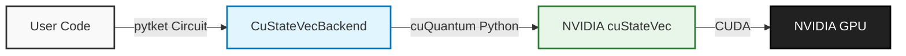

# pytket-custatevec

**GPU-accelerated statevector simulation for pytket.**

`pytket-custatevec` acts as a bridge between Quantinuum's [pytket](https://tket.quantinuum.com/) compiler and NVIDIA's [cuQuantum](https://developer.nvidia.com/cuquantum-sdk) SDK, enabling massive speedups for statevector simulations.

---

## Why use this backend?

-   :material-speedometer: **High Performance**
    ---
    Leverage NVIDIA GPUs to simulate quantum circuits significantly faster than CPU-based simulators, especially for entangling gates.

-   :material-layers-triple: **Seamless Integration**
    ---
    Works as a standard `pytket` Backend. Just switch your backend import, and your existing code runs on the GPU immediately.

-   :material-memory: **Optimized Memory**
    ---
    Utilizes `cuStateVec`'s advanced memory management to handle large statevectors efficiently on GPU VRAM.

-   :material-lock-pattern: **Gate Support**
    ---
    Supports the full range of standard gates, automatic implicit swaps, and complex measurement scenarios.

## Architecture

This library sits directly on top of the NVIDIA cuQuantum stack.

## Quick Links

Not sure where to start?

-   **Get Started**
    ---
    Install the package and set up CUDA.

    [:octicons-arrow-right-24: Installation](installation.md)

-   **See Examples**
    ---
    Run your first simulation or expectation value.

    [:octicons-arrow-right-24: View Examples](examples/index.md)

-   **API Reference**
    ---
    Deep dive into the Backend classes.

    [:octicons-arrow-right-24: Read API](api/index.md)

## Bugs and Support

Please file bugs and feature requests on the [GitHub Issue Tracker](https://github.com/CQCL/pytket-custatevec/issues).