---
hide:
  - navigation
  - toc
edit_uri: ""
---

  
  

    
    <h1>pytket-custatevec</h1>
  

  
The blazingly fast GPU backend for quantum statevector simulation.

  
  

    <a href="installation/" class="btn btn-primary">Get Started</a>
    <a href="examples/" class="btn btn-secondary">View Examples</a>
  
`

  
  
  

`pytket-custatevec` acts as a bridge between Quantinuum's [pytket](https://tket.quantinuum.com/) compiler and NVIDIA's [cuQuantum](https://developer.nvidia.com/cuquantum-sdk) SDK, enabling massive speedups for statevector simulations.

---

## Why use this backend?

-   :material-speedometer: **High Performance**
    ---
    Leverage NVIDIA GPUs to simulate quantum circuits significantly faster than CPU-based simulators, especially for entangling gates.

-   :material-layers-triple: **Seamless Integration**
    ---
    Works as a standard `pytket` Backend. Just switch your backend import, and your existing code runs on the GPU immediately.

-   :material-memory: **Optimized Memory**
    ---
    Utilizes `cuStateVec`'s advanced memory management to handle large statevectors efficiently on GPU VRAM.

-   :material-lock-pattern: **Gate Support**
    ---
    Supports the full range of standard gates, automatic implicit swaps, and complex measurement scenarios.

## Architecture

This library sits directly on top of the NVIDIA cuQuantum stack.

```mermaid
flowchart LR
    %% Node Definitions
    User([User Code])
    Backend[CuStateVecBackend]
    SDK[NVIDIA cuStateVec]
    GPU[NVIDIA GPU]

    %% Connections
    User == pytket Circuit ==> Backend
    Backend == cuQuantum Python ==> SDK
    SDK -.-> |CUDA| GPU

    %% Styling Classes
    classDef default stroke-width:2px,font-size:14px;
    
    %% User Style
    classDef user fill:#f9f9f9,stroke:#333,color:#333;
    
    %% Pytket Backend Style (Teal Border)
    classDef pytket fill:#e0f2f1,stroke:#00796b,stroke-width:2px,color:#004d40;
    
    %% NVIDIA SDK Style (NVIDIA Green)
    classDef nvidia fill:#76b900,stroke:#558600,stroke-width:2px,color:#fff;
    
    %% Hardware Style (Silver Metal - Readable)
    classDef hardware fill:#e0e0e0,stroke:#000,stroke-width:2px,color:#000,stroke-dasharray: 5 5;

    %% Apply Styles
    class User user;
    class Backend pytket;
    class SDK nvidia;
    class GPU hardware;
```

## Bugs and Support

Please file bugs and feature requests on the [GitHub Issue Tracker](https://github.com/CQCL/pytket-custatevec/issues).